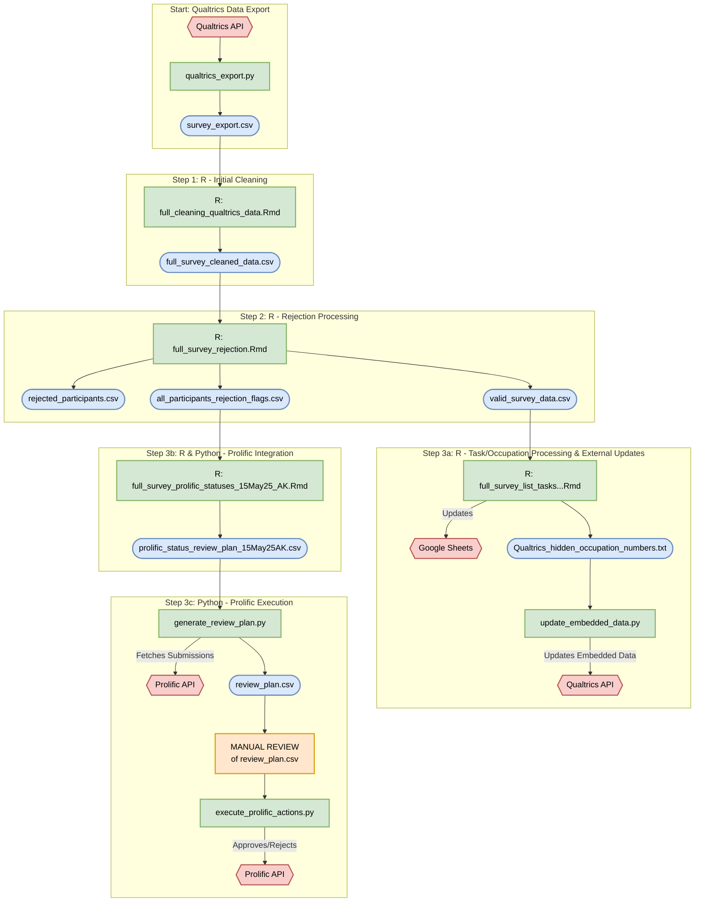

# Deployment Codebase Documentation

## 1. Project Overview

This codebase manages a comprehensive, end-to-end data processing workflow for survey-based research projects. It automates the entire pipeline, from raw data extraction from Qualtrics to final data anonymization and preparation for analysis. The system integrates with external services like Prolific for participant management and Google Sheets for collaborative data handling.

The primary goal of this repository is to provide a reliable, reproducible, and well-documented process for cleaning, validating, and preparing complex survey data, minimizing manual intervention and ensuring data integrity.

### Key Features
*   **Automated Data Export:** Fetches survey data directly from the Qualtrics API.
*   **Systematic Data Cleaning:** Applies a series of cleaning and transformation steps in R.
*   **Participant Validation & Rejection:** Implements a rules-based engine to flag and filter participants based on configurable criteria (e.g., attention checks, response duration).
*   **Prolific API Integration:** Manages participant submission statuses (approve/reject) programmatically based on validation outcomes.
*   **External Service Integration:** Updates Qualtrics embedded data and syncs data with Google Sheets.
*   **Final Data Preparation:** Produces a fully anonymized and analysis-ready dataset and a corresponding data dictionary.

## 2. Visual Workflow Diagram

The following diagram illustrates the chronological flow of scripts, data files, and interactions with external services.

## 3. In-Depth Setup

### Prerequisites

*   **Software:**
    *   R (>= 4.0.0)
    *   RStudio (Recommended)
    *   Python (>= 3.8)
*   **R Packages:**
    *   `dplyr`
    *   `here`
    *   `readr`
    *   `tidyr`
    *   `purrr`
    *   `googlesheets4`
*   **Python Libraries:**
    *   `requests`

### Configuration

This project requires credentials for external services (Qualtrics, Prolific). All configuration is handled in a single `config.py` file, which must be created in the project root.

1.  **Create the Config File:** Copy the `config.template.py` file and rename the copy to `config.py`.
2.  **Add Credentials:** Edit `config.py` and fill in the values for the Qualtrics and Prolific APIs, as well as the relevant Survey and Study IDs.
3.  **Security:** The `config.py` file is explicitly ignored by git via `.gitignore` to prevent accidental exposure of sensitive credentials.

### Directory Structure

*   `R/`: Contains all R and R Markdown scripts, organized into subdirectories by processing step.
*   `Python/`: Contains all Python scripts, organized by the API they interact with (e.g., `Qualtrics API`, `Prolific API`).
*   `FULL SURVEY data/`: The designated location for all input, intermediate, and final data files. This path is configured in the scripts and should be consistent.
*   `config.py`: (You create this) Your local, private configuration file with API keys and IDs.
*   `config.template.py`: A public template for the `config.py` file.

## 4. The Data Pipeline: A Chronological Walkthrough

This section details each script in the order of execution.

---
### **Step 0: Data Export**
---

#### `Python/Qualtrics API/qualtrics_export.py`

*   **Purpose:** Exports raw survey data from a specified Qualtrics survey.
*   **Inputs:**
    *   **Configuration:** Uses `QUALTRICS_API_TOKEN`, `QUALTRICS_DATACENTER_ID`, and `QUALTRICS_SURVEY_ID` from `config.py`.
    *   **Hardcoded Path:** The script contains a hardcoded `OUTPUT_DIR` variable that specifies where the exported file will be saved. This may need to be adjusted depending on your local setup.
*   **Process:**
    1.  Authenticates to the Qualtrics API using the provided credentials.
    2.  Sends a request to the API to start a new survey export job in CSV format.
    3.  Continuously polls the API to check the status of the export job.
    4.  Once the job is complete, it downloads the resulting `.zip` archive.
    5.  Extracts the CSV file from the archive.
*   **Outputs:**
    *   **File Created:** `survey_export.csv`
        *   **Location:** Saved in the hardcoded `OUTPUT_DIR`.
        *   **Description:** The raw, unprocessed survey data directly from Qualtrics, containing all question responses, metadata, and embedded data.

---
### **Step 1: R - Initial Data Cleaning**
---

#### `R/Step 1 - Cleaning raw survey data/full_cleaning_qualtrics_data_14May25_AK.Rmd`

*   **Purpose:** Takes the raw Qualtrics export, cleans it, and reshapes it into a usable format for analysis.
*   **Inputs:**
    *   **File Read:** `FULL SURVEY data/Raw Qualtrics Data/survey_export.csv`
        *   **Note:** The script uses `here()` to find the project root but then builds an absolute path from there. The path is effectively hardcoded.
*   **Process:**
    1.  **Loading:** Loads the raw `survey_export.csv` data.
    2.  **Initial Cleaning:** Removes the top two metadata rows from the Qualtrics file and standardizes all column names (e.g., converting `.` to `_`).
    3.  **Variable Creation:**
        *   Creates a `Wave` variable to segment participants based on `StartDate`.
        *   Calculates a `failed_attn_checks` score based on responses to attention check questions.
    4.  **Data Reshaping (Coalescing):** The script's primary operation is to combine sets of related columns. For questions that were looped in Qualtrics (e.g., `task_difficulty_1`, `task_difficulty_2`), it merges them into a single column (e.g., `task_difficulty`), making the data "tidy".
    5.  **Column Selection:** Selects a final set of cleaned, coalesced, and newly-created variables for the output dataset.
*   **Outputs:**
    *   **File Created:** `full_survey_cleaned_data.csv`
        *   **Location:** Saved to a hardcoded absolute path pointing to `FULL SURVEY data/Cleaned survey data/`.
        *   **Description:** A cleaned and processed version of the survey data. It contains one row per participant response, but the looped question data has been reshaped into a more accessible format. This file is the primary input for the subsequent rejection-processing step.

---
### **Step 2: R - Rejection Processing & Validation**
---

#### `R/Step 2 - Reject data/full_survey_rejection_15May25_AK.Rmd`

*   **Purpose:** Applies a rigorous set of rejection criteria to the cleaned data to identify and filter out invalid responses. It generates several outputs for analysis, auditing, and subsequent pipeline steps.
*   **Inputs:**
    *   **File Read:** `FULL SURVEY data/Cleaned survey data/full_survey_cleaned_data.csv`
        *   **Note:** The script uses `here()` but then builds a hardcoded, absolute path.
*   **Process:**
    1.  **Flagging Invalid Responses:** The script systematically identifies participants who meet any of the following rejection criteria:
        *   **Failed Attention Checks:** Failed two or more attention checks.
        *   **No Consent:** Did not provide informed consent.
        *   **Insufficient Experience:** Reported having "0-5 months" or "None" for work experience.
        *   **Task Misunderstanding:** Indicated they did not understand the tasks.
        *   **Rushing:** Responded faster than a predefined threshold (e.g., spending less than 4 seconds on average across their 3 fastest responses).
        *   **Repetitive Answers:** Provided the same answer for a majority of the questions across all five given tasks.
        *   **Contradictory Logic:** Provided answers that were logically inconsistent (e.g., rating a response as "Not at all easy," "Not at all relevant," etc., but also stating it was "Useful as is").
        *   **Extreme Time Estimates:** Provided task time estimates exceeding two weeks (336 hours).
    2.  **Status Assignment:** It creates a comprehensive flag file for **all** participants. Based on a priority order, it assigns each participant a single, mutually exclusive status: `rejected`, `screened_out`, or `approved`.
*   **Outputs:**
    *   **File Created:** `rejected_participants_15May25AK.csv`
        *   **Location:** Saved to a hardcoded absolute path in `FULL SURVEY data/Rejection data/`.
        *   **Description:** A list of all Prolific IDs who were rejected and columns indicating the specific reason(s) why.
    *   **File Created:** `valid_survey_data_15May25AK.csv`
        *   **Location:** Saved to a hardcoded absolute path in `FULL SURVEY data/Final Survey Data/`.
        *   **Description:** The survey data for **only** the participants who passed all validation checks. This is the "clean" data for final analysis.
    *   **File Created:** `all_participants_rejection_flags_15May25AK.csv`
        *   **Location:** Saved to a hardcoded absolute path in `FULL SURVEY data/Final Survey Data/`.
        *   **Description:** A critical audit file. Contains every participant from the initial dataset, with boolean flags for each rejection check and their final, assigned status (`approved`, `rejected`, etc.). This file is the input for the Prolific integration step.

---
### **Step 3a: R & Python - Dynamic Content Updates**
---

#### `R/Step 3.1 - List task instances & jobs/full_survey_list_tasks_and_occupation_15May25_AK.Rmd`

*   **Purpose:** Determines which "occupations" have had all their associated tasks completed by participants, and prepares a list of these occupations to be hidden in Qualtrics for future participants.
*   **Inputs:**
    *   **File Read:** `FULL SURVEY data/Final Survey Data/valid_survey_data_15May25AK.csv` (The clean, valid data).
    *   **File Read:** `FULL SURVEY data/Task instances/Formatted/task_urls_HTML_benchmark_PDF_2_19_ALL_FINAL.xlsx` (The master list of all possible tasks and occupations).
*   **Process:**
    1.  **Extracts Completed Tasks:** Scans the valid survey data to create a unique list of all `TASK_ID`s that have been completed.
    2.  **Identifies Completed Occupations:** Compares the list of completed tasks against the master task list from the Excel file to find "occupations" for which all assigned tasks are now complete.
    3.  **Generates Occupation List:** Creates a comma-separated string of the numeric IDs for the completed occupations.
*   **Outputs:**
    *   **File Created:** `qualtrics_hidden_occupation_numbers.txt`
        *   **Location:** Saved to `FULL SURVEY data/Remaining occupation list/`.
        *   **Description:** A text file containing a single, comma-separated line of occupation numbers (e.g., "3, 12, 25"). This file is the direct input for the `update_embedded_data.py` script.
    *   **Informational Files:** Also creates `completed_tasks.csv`, `not_completed_tasks.csv`, and others in the same directory for manual review.

#### `Python/Qualtrics API/update_embedded_data.py`

*   **Purpose:** Updates the survey flow in Qualtrics to hide completed occupations from new participants.
*   **Inputs:**
    *   **File Read:** `Python/Qualtrics API/qualtrics_hidden_occupation_numbers.txt`
        *   **Note:** The script expects this file to be in the **same directory** as itself. The previous R script saves it to a different location, so a manual file move is currently required.
    *   **Configuration:** Uses `QUALTRICS_API_TOKEN`, `QUALTRICS_DATACENTER_ID`, and `QUALTRICS_SURVEY_ID` from `config.py`.
*   **Process:**
    1.  **Reads Occupation Numbers:** Reads the comma-separated list of numbers from the text file.
    2.  **Fetches Survey Flow:** Makes a GET request to the Qualtrics API to download the entire JSON structure of the survey flow.
    3.  **Finds and Updates Field:** Searches the JSON for an "Embedded Data" element that contains a field named `hidden_occupation_numbers`. It then updates the value of this field with the numbers it read from the file.
    4.  **Pushes Updated Flow:** Makes a PUT request to the API, sending the modified survey flow element back to Qualtrics to apply the change.
*   **Outputs:**
    *   **Side Effect:** The "hidden_occupation_numbers" field in the Qualtrics survey is updated. This will dynamically change the survey experience for new participants, preventing them from seeing occupations that are already complete.
    *   **Console Output:** Prints a detailed log of the API operations and their success or failure.

---
### **Step 3b: R & Python - Prolific Integration**
---

#### `R/Step 3.2 - data for approval + denial in Prolific/full_survey_prolific_statuses_15May25_AK.Rmd`

*   **Purpose:** Transforms the detailed rejection flags into a simple, standardized format required by the Prolific API scripts.
*   **Inputs:**
    *   **File Read:** `FULL SURVEY data/Final Survey Data/all_participants_rejection_flags_15May25AK.csv` (The comprehensive audit file from Step 2).
*   **Process:**
    1.  **Consolidates Status:** Converts the boolean (`TRUE`/`FALSE`) status columns from the input file into a single `status` column containing the text "APPROVED", "REJECTED", or "SCREENED-OUT".
    2.  **Assigns Rejection Reasons:** For participants with a "REJECTED" status, it adds the specific rejection reason text and category code required by Prolific's API.
*   **Outputs:**
    *   **File Created:** `prolific_status_review_plan_15May25AK.csv`
        *   **Location:** Saved to `FULL SURVEY data/Final Survey Data/`.
        *   **Description:** A clean, four-column CSV (`prolific_id`, `status`, `reason`, `category`) that serves as the direct input for the `generate_review_plan.py` script.

#### `Python/Prolific API/Python files/generate_review_plan.py`

*   **Purpose:** Creates a safe, reviewable action plan by comparing the local rejection decisions with the live status of submissions on Prolific.
*   **Dependencies:** `prolific_utils.py`, `completion_codes_config.py`
*   **Inputs:**
    *   **File Read:** `FULL SURVEY data/Final survey data/all_participants_rejection_flags_15May25AK.csv`
        *   **Note:** The path to this file is hardcoded in the script.
    *   **Configuration:** Uses `PROLIFIC_API_TOKEN` (via `prolific_utils`) and `PROLIFIC_STUDY_ID` from `config.py`.
    *   **External Service:** Fetches all submissions for the specified `PROLIFIC_STUDY_ID` from the Prolific API.
*   **Process:**
    1.  **Fetches Live Data:** Gets the current status of all participant submissions from the Prolific API.
    2.  **Loads Local Decisions:** Loads the status decisions (approved, rejected, etc.) from the output of the R rejection scripts.
    3.  **Compares and Proposes Actions:** For each live submission, it compares the Prolific status with the local decision and proposes a safe action. For example:
        *   If local is `APPROVED` and Prolific is `AWAITING REVIEW`, it proposes `APPROVE`.
        *   If local is `REJECTED` and Prolific is `AWAITING REVIEW`, it proposes `REJECT`.
        *   If the submission is already `APPROVED` on Prolific, it proposes `NO_ACTION_ALREADY_APPROVED` to prevent errors.
        *   If there is a discrepancy (e.g., no local data for a live submission), it proposes `MANUAL_REVIEW` to flag it for human inspection.
*   **Outputs:**
    *   **File Created:** `review_plan_with_validation.csv`
        *   **Location:** Saved in the project root directory.
        *   **Description:** The primary output of this script. A detailed CSV listing every submission, its live status, its local status, and the `proposed_action`. **This file must be manually reviewed before proceeding to the next step.**

#### `Python/Prolific API/Python files/execute_prolific_actions.py`

*   **Purpose:** Executes the approvals and rejections on the Prolific platform based on the user-verified review plan.
*   **Dependencies:** `prolific_utils.py`, `completion_codes_config.py`
*   **Inputs:**
    *   **File Read:** `review_plan_with_validation.csv` (from the project root).
    *   **Configuration:** Uses `PROLIFIC_API_TOKEN` (via `prolific_utils`) from `config.py`.
    *   **User Confirmation:** Prompts the user in the console for a final "yes/no" before making any changes.
*   **Process:**
    1.  **MANUAL STEP:** The user must first manually review `review_plan_with_validation.csv` to ensure the proposed actions are correct.
    2.  **Reads Plan:** The script reads the review plan.
    3.  **Filters for Actions:** It filters the plan to find only submissions with a `proposed_action` of `APPROVE` or `REJECT`.
    4.  **Requests Confirmation:** It prints a summary of actions to be taken and requires the user to type "yes" to proceed.
    5.  **Executes API Calls:** If confirmed, it iterates through the filtered submissions and calls the Prolific API to perform the specified action for each one. It includes exponential backoff to respect API rate limits.
*   **Outputs:**
    *   **Side Effect:** Submissions on Prolific are programmatically approved or rejected. **This is the script that makes live changes to participant payments.**
    *   **Console Output:** Provides a real-time log of each API call, its status (success, failure, retry), and a final summary.

---
### **Step 4: R - Final Data Preparation**
---

#### `R/Step 4 - Prepare data for sharing/full_survey_final_data_prep_15May25_AK.Rmd`

*   **Status:** Placeholder Script
*   **Purpose:** This script is intended for the final anonymization and preparation of the data for analysis or public sharing.
*   **Note:** As of the last review, this script is a placeholder and does not contain executable code. The steps below describe its intended function.
*   **Inputs:**
    *   **File Read:** `FULL SURVEY data/Final Survey Data/valid_survey_data_15May25AK.csv` (The fully cleaned and validated dataset).
*   **Intended Process:**
    1.  **Anonymization:** Remove or hash any remaining columns that could contain personally identifiable information (PII), such as free-text fields.
    2.  **Final Column Selection:** Select and rename columns to prepare a clean, analysis-ready dataset. For example, renaming columns from technical IDs (e.g., `resp_manager_rating_1`) to descriptive names (`manager_rating_clarity`).
    3.  **Data Dictionary Generation:** (Optional) Create a data dictionary file (e.g., a CSV or Markdown file) that describes each variable, its data type, and its possible values/levels.
*   **Outputs (Intended):**
    *   **File Created:** `final_anonymized_survey_data.csv`
        *   **Description:** The final, fully processed dataset, ready for analysis or sharing.
    *   **File Created:** `data_dictionary.csv`
        *   **Description:** A codebook explaining the variables in the final dataset.