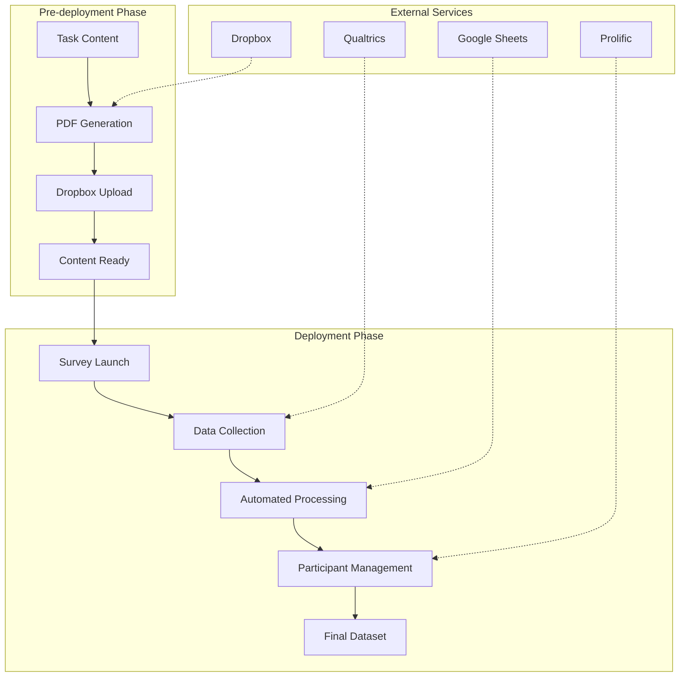

# Survey Research Platform

## Overview

This is a complete end-to-end research platform for conducting large-scale surveys with AI-generated content. The system is split into two phases:

1. **Pre-deployment**: Content preparation and infrastructure setup
2. **Deployment**: Live survey execution, data processing, and participant management

The platform automates the research workflow from content generation through final datasets, integrating with Qualtrics, Prolific, Dropbox, and Google Sheets.

## System Architecture



## Pre-deployment Codebase

**Purpose**: Converts survey content into organized PDFs and uploads them to Dropbox with systematic naming and Latin Square randomization.

**Main Script**: `Pre-deployment codebase/Dropbox upload/PDF_upload.py`

**What it does**:
- Takes Excel files with task descriptions and AI model responses
- Generates consistently formatted PDFs
- Uploads to Dropbox with structured naming (e.g., `task_001_01_1.pdf`)
- Applies Latin Square randomization for experimental balance
- Creates final Excel file with randomized model orders and Dropbox URLs

**Key Features**:
- Concurrent upload processing with retry logic
- Automatic ID generation for systematic organization
- Progress tracking for long-running operations

## Deployment Codebase

**Purpose**: Manages live survey operations from data collection through analysis-ready datasets.

> **Detailed Documentation**: See `Deployment codebase/README.md` for comprehensive technical documentation, including complete script descriptions, API interactions, and workflow diagrams.

**Key Components**:

### 1. Data Pipeline
- **Export**: Downloads survey data from Qualtrics
- **Cleaning**: Standardizes and reshapes data into analysis format
- **Validation**: Applies comprehensive quality control (attention checks, response patterns, timing analysis)
- **Output**: Clean dataset + detailed audit trail

### 2. Dynamic Content Management
- **Monitoring**: Tracks which tasks have been completed
- **Updates**: Automatically hides completed content from new participants
- **Integration**: Real-time updates to Qualtrics survey flow

### 3. Participant Management
- **Processing**: Transforms validation results for Prolific integration
- **Review**: Generates safe action plans comparing local decisions with live data
- **Execution**: Programmatically approves/rejects participants (with manual review)

### 4. External Service Integration
- **Qualtrics**: Data export, survey flow updates
- **Prolific**: Participant approval/rejection management
- **Google Sheets**: Real-time collaboration and data sharing
- **Dropbox**: Content hosting and organization

## Setup

### Prerequisites
- R (≥ 4.0.0) with basic packages (`dplyr`, `readr`, etc.)
- Python (≥ 3.8) with standard libraries
- API access to Qualtrics, Prolific, Dropbox, Google Sheets

### Configuration
1. Copy `Deployment codebase/config.template.py` to `config.py`
2. Add your API tokens and survey/study IDs
3. Configure file paths in pre-deployment scripts

### Security
- All config files with API keys are git-ignored
- Never commit credentials to version control

## Usage

### Pre-deployment
1. Prepare task content in Excel format
2. Run `PDF_upload.py` to generate and upload PDFs
3. Verify upload completion and randomization balance

### Deployment
1. Export data from Qualtrics
2. Run R scripts sequentially (Step 1 → Step 2 → Step 3.x)
3. **Manual Review Required**: Always review Prolific action plans before execution
4. Execute participant management actions

## Key Safety Features

- **Manual Review Points**: Critical decisions require human approval
- **Audit Trail**: Complete logging of all processing decisions
- **Safe Execution**: Conflict detection between local and live data
- **Rate Limiting**: Respectful API usage with retry logic

## Data Flow

```
Raw Survey Data → Cleaned Data → Validated Data → Participant Decisions → Final Dataset
```

Each step produces intermediate files for auditing and can be re-run independently.

---

**Note**: This system handles real participant payments through Prolific. Always review action plans carefully before execution. 